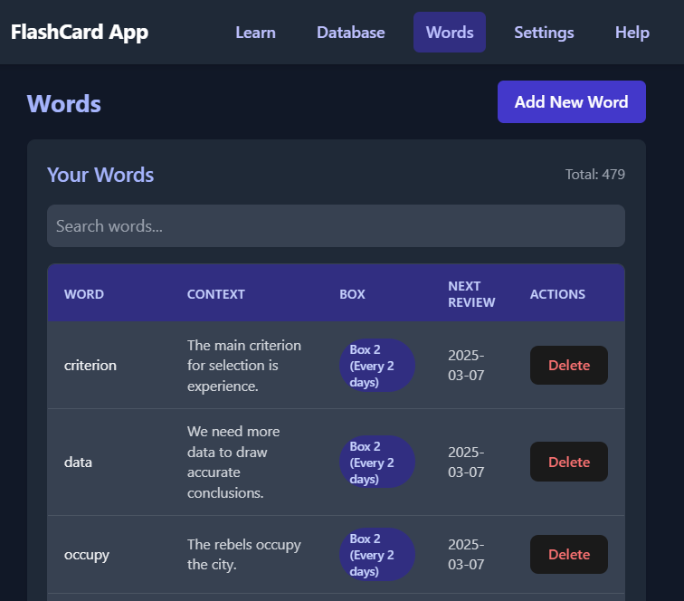
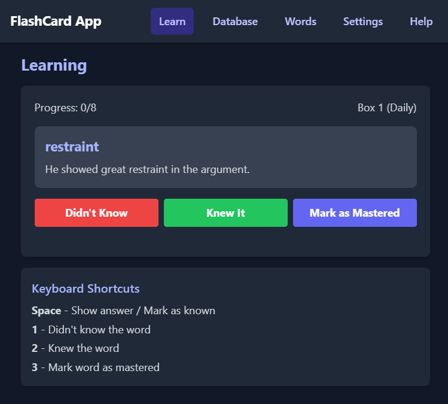
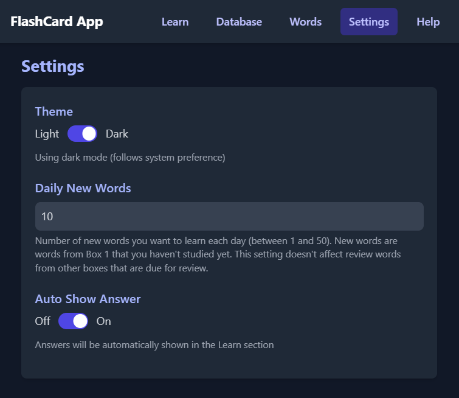

# FlashCard App

A modern flashcard application built with React and TypeScript, featuring a spaced repetition system to help you effectively learn and memorize words.

## Features

- **Spaced Repetition System**: Uses a modified Leitner system with 6 boxes
- **Progress Tracking**: Monitor your learning progress with detailed statistics
- **Dark/Light Mode**: Supports system theme preference
- **Import/Export**: Easily backup or share your word collections
- **Customizable Learning**: Set daily new word limits
- **Responsive Design**: Works on both desktop and mobile devices

## Screenshots



*Add and manage your vocabulary*



*Review words using spaced repetition*


*View your progress within the application*



*Customize your learning experience*

## Spaced Repetition System

This app uses a modified Leitner system with 6 boxes for efficient learning:

| Box | Review Interval | Description |
|-----|----------------|-------------|
| 1   | Every day      | New words or words you had difficulty remembering |
| 2   | Every 2 days   | Words you've remembered once |
| 3   | Every 4 days   | Words you've remembered twice |
| 4   | Every 7 days   | Words you've remembered three times |
| 5   | Every 14 days  | Words you've remembered four times |
| 6   | Never          | Mastered words that don't need further review |

### How it Works

1. New words start in Box 1
2. If you remember a word correctly, it moves up one box
3. If you forget a word, it returns to Box 1
4. Words in Box 6 are considered mastered and won't appear in reviews

## Getting Started

### Prerequisites

- Node.js (v18 or higher)
- npm or yarn

### Installation

1. Clone the repository:
```bash
git clone https://github.com/alised/flashcard_react.git
cd flashcard_react
```

2. Install dependencies:
```bash
npm install
```

3. Start the development server:
```bash
npm run dev
```

## Build and Deployment

### Local Build

To create a production build locally:

```bash
npm run build
```

This will create a `dist` directory with the compiled assets.

To preview the production build:

```bash
npm run preview
```

### Deployment

The application can be deployed to various platforms:

#### Static Hosting (Recommended)
Deploy the contents of the `dist` directory to any static hosting service like:
- GitHub Pages
- Netlify
- Vercel
- Firebase Hosting

#### Self-Hosted
1. Build the application using `npm run build`
2. Serve the `dist` directory using a web server like Nginx or Apache
3. Configure your web server to handle client-side routing

## Usage

1. Add new words in the Words section
2. Review due words in the Learn section
3. Import/Export your collection in the Database section
4. Customize your experience in the Settings section

## Technical Stack

- React
- TypeScript
- Tailwind CSS
- Vite
- IndexedDB (via Dexie.js)

## License

This project is licensed under the MIT License - see the [LICENSE](LICENSE) file for details.

## Contributing

Contributions are welcome! Please feel free to submit a Pull Request.
